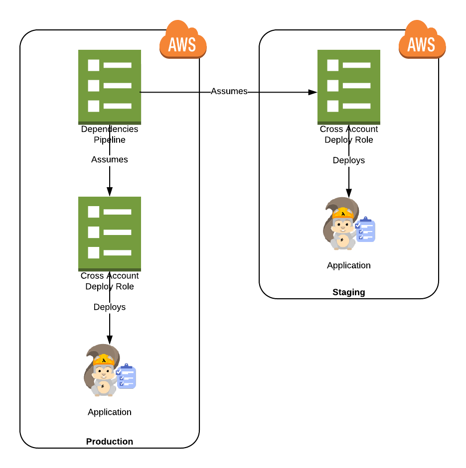
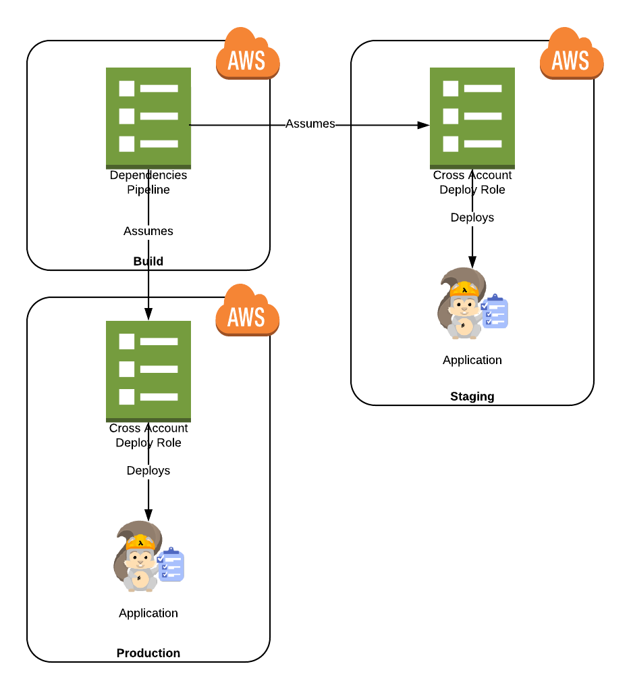

# Golang Lambda Pipeline

This repository contains a serverless application, and multi-stage pipeline to
perform CI/CD on it.

## Setup

1. Launch the [deploy
   role](dependencies/cross-account-deploy-role-template.yaml) template to the
deploy accounts, passing the build account's id.
1. Gather the cross-account role ARNs from the stacks' outputs.
1. Deploy the [pipeline and its
   dependencies](dependencies/dependencies-template.yaml) template to the build
account, passing the deploy role ARNs and other parameters.
1. Get the repository URL from the pipeline's stack outputs.
1. Push this repository's code to the repository to trigger a build and
   deployment to the staging account.
1. Manually approve the deployment in to the production account.
1. Profit!

## Accounts

Multiple accounts are used so that:

* Blast radius is limited. Issues in the deploy accounts cannot impact other
  deploy accounts.
* No runtime dependencies on the pipeline. The pipeline resources (and the
  associated resources) can be removed without impacting the running application.

While multiple accounts are part of the architecture, nothing is stopping you
from using _less_ accounts - just supply the same Account Id in multiple
locations (e.g. when the pipeline and repo are in the production account). The
same deployment role can be used for both the staging and production stages,
and they can all be in the same account.

### Recommended

The recommend deployment pattern is a "pipline in production" approach This is
based on the reasoning that anything that can modify production, **is
production**:

### Alternative

Some setups involve the idea of a "build" environment, which is a
production-like environment that is separate from the application's production
environment (usually for administrative reasons).

This approach can also work, as long as appropriate controls are in place on
the build environment:

## Application

### SAM Template

A [serverless application (using AWS SAM)](template.yaml) template is
included to simulate a real-world application.  The application consists of a
`golang` Lambda function (with tests), and API Gateway endpoint.

The application's build is managed via a CodeBuild
[`buildspec.yaml`](buildspec.yaml) file. All of the tasks are managed via
[`make`](makefile).

### Deploy Accounts

The accounts where the application will be deployed (e.g. staging and
production).  These accounts must have some resources deployed in them to
facilitate the pipeline's access to deploy (e.g. cross-account role, etc).

* Changes are deploy to the **same** named stacks e.g. `ApplicationName-staging`.
* Changes are automatically applied to the staging stack.
* Manual approval is required before a [change
  set](https://docs.aws.amazon.com/AWSCloudFormation/latest/UserGuide/using-cfn-updating-stacks-changesets.html)
is created in production, **and** before the change set is applied (i.e. there
are two approvals required).

## Design

### Pipeline Stages

### Build Pipeline

This high-level diagram represents the resources that are created by the
[`dependencies-tempalate.yaml`](dependencies/dependencies-template.yaml).

1. Developers push code.
1. Pipeline is triggered by commits to `master`.
1. A build container builds the source using `make` commands (defined in
   `buildspec.yaml`).
1. Build artefacts are packaged and stored for deployment in S3 using `aws
   cloudformation package`.
1. The change set is automatically deployed to the staging environment stack.
1. The change must be manually approved before anything is deployed to
   production.
1. The change set is applied to the production stack, and must then be approved
   *again* before it is deployed.

### Deploy Account

The following resources are created and referenced in the deploy accounts:

## Links

* [Golang support for AWS Lambda](https://aws.amazon.com/blogs/compute/announcing-go-support-for-aws-lambda/),

* [Building CI/CD Pipelines for Serverless Applications - SRV302 - re:Invent 2017](https://www.youtube.com/watch?v=dCDZ7HR7dms) video

* [Building CI/CD Pipelines for Serverless Applications - SRV302 - re:Invent 2017](https://www.slideshare.net/AmazonWebServices/building-cicd-pipelines-for-serverless-applications-srv302-reinvent-2017) slides

* All CodeBuild Docker images are [on GitHub](https://github.com/aws/aws-codebuild-docker-images)
