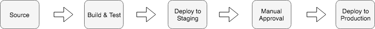
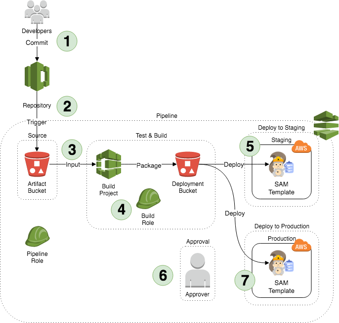
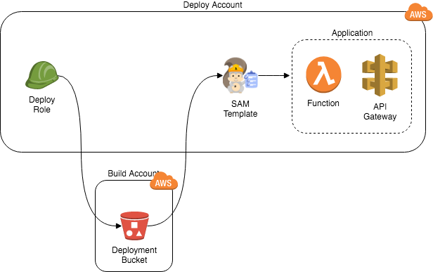

# Lambda Pipeline

This repository contains a serverless application, and multi-stage pipeline to perform CI/CD on it.

## Setup

1. Deploy the deploy-dependencies.yaml template to the deploy accounts, passing the build account's id.
1. Gather the cross-account roles' ARNs.
1. Deploy the build-pipeline.yaml template to the build account, passing the deploy role ARNs and other parameters.
1. Get the repository URL from the pipeline's stack outputs.
1. Push this repository's code to the repository to trigger a build and deployment to the staging account.
1. Approve the deployment to the production account.
1. Profit!

## Resources

* CodeCommit repository
* CodePipeline pipeline and associated resources
* CodeBuild project and associated resources
* Cross-account roles to deploy the application.
* Sample SAM application (see below)

### CloudFormation Templates

## Sample SAM Application

A demo serverless application (using AWS SAM) is included to simulate a real-world application.
The application consists of a golang Lambda function (with tests), and API Gateway endpoint.

## Accounts

Multiple accounts are used so that:

* Blast radius is limited. Issues in the deploy accounts cannot impact other
  deploy accounts.
* No runtime dependencies on the pipeline. The pipeline resources (and the
  associated resources in the build and deploy accounts) can be removed without
impacting the running application.

While multiple accounts are part of the architecture, nothing is stopping you
from using _less_ accounts - just supply the same Account Id in multiple
locations (e.g. when the pipeline and repo are in the production account).

### Build Account

The build account hosts the pipeline, and must have access (via cross-account roles) to the deploy accounts.

### Deploy Accounts

The accounts where the application will be deployed (e.g. staging and production).
These accounts must have some resources deployed in them to facilitate the pipeline's access to deploy (e.g. cross-account role, etc).

In the case of staging, **updates are deployed to the same stack**.

## Design

### Pipeline Stages

### Build Pipeline

1. Developers push code
1. Pipeline is triggered by commits to `master`
1. A build container builds the source using `make` commands (defined in `buildspec.yaml`)
1. Build artefacts are packaged and stored for deployment in S3 using `aws cloudformation package`
1. The application is automatically deployed to the staging environment
1. The change must be manually approved
1. The same packages are used to deploy the application to production

### Deploy Account

## Links

* [Golang support for AWS Lambda](https://aws.amazon.com/blogs/compute/announcing-go-support-for-aws-lambda/),

* [Building CI/CD Pipelines for Serverless Applications - SRV302 - re:Invent 2017](https://www.youtube.com/watch?v=dCDZ7HR7dms) video

* [Building CI/CD Pipelines for Serverless Applications - SRV302 - re:Invent 2017](https://www.slideshare.net/AmazonWebServices/building-cicd-pipelines-for-serverless-applications-srv302-reinvent-2017) slides

* All CodeBuild Docker images are [on GitHub](https://github.com/aws/aws-codebuild-docker-images)

## To Do

### Alpha

* GitHub.com PRIVATE repo - confirm location of checkout
* Cross-account deployment
* Run in local CodeBuild container?
* Confirm documentation steps
* Include PNG diagrams
* Set parameters in application stack

### Beta

* `sam-local`
* S3 SSE using KMS.
* Split in to layers? e.g. IAM
* Deploy notification e.g. Slack, email, etc
* Tags via Template Configuration file
  https://docs.aws.amazon.com/AWSCloudFormation/latest/UserGuide/continuous-delivery-codepipeline-cfn-artifacts.html#w2ab2c13c15c15

